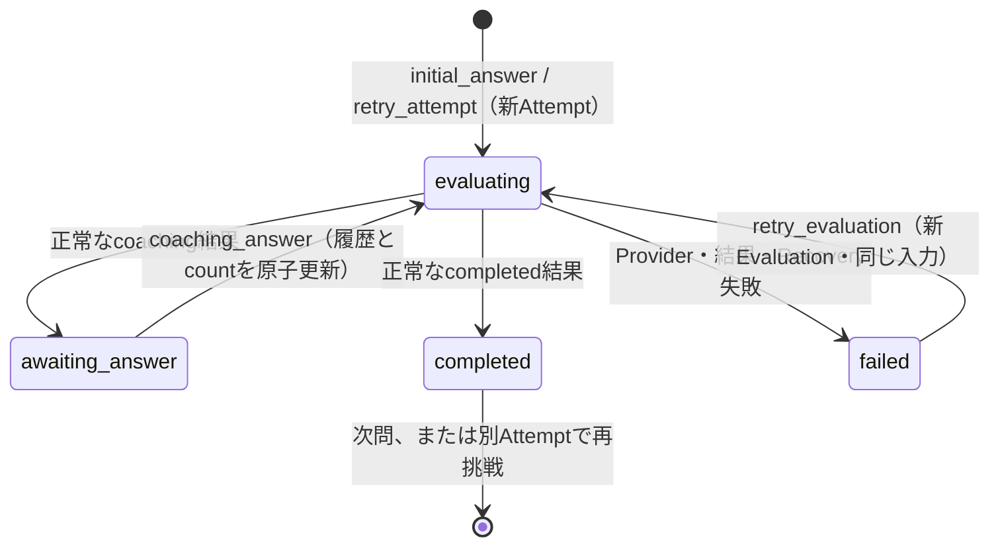

# 回答採点・コーチング V2

更新日: 2026-10-07。ローカル実装・オフライン検証。
既存 API → DynamoDB → Streams → Dispatcher → SQS → Worker を維持する。
AWS upload/apply、有効化、実AI接続は実施していない。

## API・文字数・採点

| 対象 | 新規入力 | 互換性 |
|---|---|---|
| 管理質問 | 新規ID・本文変更だけ200コードポイント | 同じID原表記・本文なら旧長文を保持。移動・カテゴリ変更も可 |
| V2本人回答 | 初回・深掘り400コードポイント | 同キー元応答を状態判定前に再現 |
| V1本人回答 | 従来の500 UTF-16単位 | 旧Schema・fingerprint・100点結果を保持 |
| Provider文章 | 質問/good_point/improvement各200、example400 | 非空、上限、nullableを厳密検証。不正結果はfailed |

JSの`Array.from(text).length`と同じ計測。空白・CRLF・結合文字・ZWJを数え、原文を正規化しない。
共通fixture: `contracts/coaching-v2-fixtures.json`。サロゲートは同じUTF-16原文とcanonical JSONが復元されることも検証。

`kind`がない要求はV1、存在する要求はV2。null・未知値・不完全V2は400で、V1へフォールバックしない。
V2は余分な項目を禁止。202は`attemptId/evaluationId/status:processing`の3項目を維持する。

| kind | Payload | 許可する起点 |
|---|---|---|
| initial_answer | questionId, answer | activeなし、またはV1 failed |
| coaching_answer | questionId, answer, attemptId, fromEvaluationId | 現在のV2 awaiting_answer |
| retry_evaluation | attemptId, fromEvaluationId | 現在のV2 failed。本文を受け取らない |
| retry_attempt | questionId, answer, fromAttemptId, fromEvaluationId | 現在のcompleted結果。新Attemptを作る |

別ownerは404、不正UUIDは400、古い起点・不許可状態は409。関連欠落・版不一致は安全な整合性分類と固定500。
V2 activeへの新しいlegacy submit、V2 failedのinitial_answerによるリセットは拒否する。
拒否・再送時は本文・履歴・count・pointer・質問番号・owner・Evaluation/Dispatch数・revを再変更しない。

Provider結果は8項目がrequiredで追加項目禁止:
`status/conclusion_score/specificity_score/reasoning_score/good_point/improvement/follow_up_question/example`。
3軸は各0〜10整数。coachingは質問必須・example=null、completedは質問=null・example必須。
Backendが`baseScore=3軸の和`、`totalScore=max(0,baseScore-lengthPenalty)`を計算する。
初回回答300以下は減点0、301〜350は1、351〜400は2。helperの401以上減点3はV2受付では到達せず、V1へ適用しない。
rankはS=26〜30、A=21〜25、B=15〜20、C=0〜14。追加回答の長さで減点を変更しない。

## 保存・状態・非同期

Session保存形式は変更せず、GETでV2 Attemptの進行を合成する。
Attemptは不変で初回Evaluation IDを固定。V2の進行は同じテーブルの`COACHING#attemptId`。
Evaluationへ元質問、初回回答、回答済み履歴、最新回答、count、質問可否、取得不能質問を固定保存する。
retry_evaluationは固定入力をコピーして新しいEvaluation/Dispatchを作り、再試行元failedを保持する。
物理schema_version=1、canonical JSON、キー、rev、WorkIndexを維持する。

countは正常受付した深掘り回答数=履歴数、0〜3。質問生成では増えない。3回回答後は低得点でもcompleted。
履歴の質問はサーバーのpending_questionから作る。source Evaluationのowner/Attempt/固定入力/成功結果/質問/時刻も検証。
失敗後も履歴・count・last_successful_evaluation_idを保持する。
Sessionと可変進行をCAS付きPutで一括更新し、新しいUSER領域ConditionCheck権限は要求しない。
既存の要求・時刻予算と応答消失確認を使用し、要求内の生成IDと202を固定する。
正常な過去terminalの再配送はno-opで現在進行を巻き戻さない。round=0の初回評価再試行も新Evaluationとして扱う。

V1は旧Prompt/結果版1、V2は`interview-coaching-v2`/結果版2。Fake/40秒予算を維持。
Provider開始記録の永続確認後に1回だけ呼ぶ。開始後の結果不明はOUTCOME_UNKNOWN、自動再呼出しなし。
保存応答消失で再確認するのは同じFeedback保存だけ。明示再試行だけが新Evaluationを作る。

固定指示と本人入力を別フィールドにし、累積、はい/いいえ、明示的な訂正・撤回、曖昧な矛盾、取得不能をPromptへ明記。
AI質問単独・過去の評価文/exampleを本人事実にせず、本人回答内の命令をデータとして扱う。
矛盾は質問可能なら確認し、上限では不確かな部分を除外。原履歴を書き換えない。
質問防御はNFKCと空白除去後の完全一致と明白な複数の箇条書き質問。原文は変更しない。
改行、疑問符の数、単一質問の選択肢だけでは拒否しない。意味上の重複・創作は実モデルEval対象。

Fakeの通常V2成功はcompletedの検証用サンプル。シナリオはテスト用注入/Mock設定で選び、本人回答のmagic stringを使わない。
共通fixtureは累積・肯定・否定・訂正・撤回・置換・取得不能・上限時矛盾除外・prompt injectionを含む。
fixtureの入力保持・契約・期待出力の試験は、実モデルの事実解釈や採点品質の証明ではない。

## 読取り・画面・復旧

Evaluation GETは公開statusを維持し、V2だけfeedbackVersion=2を付加。
Feedback GETは`?evaluationId=<UUID>`で過去評価、省略時は最新。未成功は409。
V2 Feedbackは初回answer、latestAnswer、履歴/count、8項目result、集計/rank/Evaluation IDを返し、旧100点項目を併記しない。
markerなしはV1、2はV2。未知marker・不正V2をV1へ読み替えない。
Session GETのV2 activeにだけactiveCoachingを付け、evaluating/failedでも送信済み履歴を復元する。
owner/lease/call_phase/WorkIndexを公開せず、本人原文をHTMLへ変換しない。

結果URL: `/result/?attemptId=<id>&evaluationId=<id>`。
待機URL: `/practice/session/?sessionId=<id>&mode=evaluation&evaluationId=<id>`。
旧URLを保持し、query key・Container・遷移済み判定にEvaluationを含める。古い待機起点は現在の練習への案内を表示。
現在coachingだけ回答フォームを有効にする。過去結果は閲覧のみ。failedは履歴を表示し評価だけを再試行する。
完成後の再挑戦は空のフォームと新Attemptから始める。

共通useAnswerOperationが固定キー/Payload、pending保存、結果不明の同キー再確認を処理。Mutation自動retryなし。
過長draftも保持し送信だけ無効。V1 pendingは旧500単位Schemaで復元して元要求を再確認する。
scopeを開始時に固定し、利用者切替・ログアウト後の遅延応答を遮断する。確定409で旧起点を自動送信しない。

Mockはpocket:mock:v3。sessions/attempts/evaluations/coachings/requestsを分離する。
attemptsの初回Evaluation IDは固定し、既存画面向け最新評価キャッシュを併置。評価履歴の正本はevaluations。
V2/V1を元Schemaで読み、旧ID/日時/Feedback/冪等応答を保全してV3へコピー。
旧キーを削除せず、破損V3から黙って旧データへ戻さない。V1に進行レコードを捏造しない。

## 検証

Backend: Ruff lint/format、AWS非接続pytest **1013 passed、57 deselected**（AWS明示実行の試験）、旧V1 demo成功。
V2追加回帰73件には4ラウンド、Unicode、初回ID不変、round0 retry、過去再配送、同時受付/再試行、応答消失確認、Recovery、拒否時の状態/rev不変を含む。
時計が後退した受付でも履歴・Evaluation時刻を整合させ、要求内の時刻を固定する。
Frontend: lint/typecheck、単体・統合 **259件成功**、Storybookブラウザ **389件成功**。
実API用/Mock用Static Export、Storybook buildが成功。V1 pending 500単位の元Payload再確認、V2 failedと古いdraftが共存する復旧、再試行の確定拒否後もfailedを保持する試験を含む。
Mock Playwright **24件成功**。深掘り3回、完成後の空入力での新Attempt、過去結果の閲覧限定、failed後reloadと回答なしの評価再試行をブラウザで確認した。
Terraform: fmt、隔離コピーのbackendなしvalidate（bootstrap/dev/test/service）、mock test **35件成功**。元構成/lockfileのhash不変をhelperで照合。
Linux ZIP: uv.lockの12依存、既存builder、Python **3.14.4/x86_64**の既存WSLで展開・4 handler/native extension import・V2 4ラウンド・過去読取・次問に成功。socket接続は禁止。
ZIP SHA-256: `dfe1fd8c68959d6ba3e044d329d9661b52f1c7e260bd450555f442523bf49768`。
manifestは作業中ソースの検証用で、配備承認済みArtifactではない。
このZIPは下記レビュー修正前のソースを含む。修正後のZIP再生成・Linux検証は未実施で、現行ソースと一致する資材としては扱わない。

Terraform/IAM/閉鎖フラグ/runtime/architecture/512MB/Worker timeout60秒/MaximumConcurrency=2に変更なし。
AWS配備・実機Smoke/Performance・実Provider/実モデルEvalは未実施。Remote dev状態は今回読み取っていない。
次工程は対象commit/Artifact/saved planを具体化し、既存承認テンプレートと条件付き自動Closureに従う。

### 2026-10-07 Backendレビュー後の修正

- 最終問の次問要求でもV2進行の整合性とcompletedを先に確認する。深掘り回答待ちは409 SESSION_STATE_CONFLICT、V2/V1の完了済み最終問は従来どおり409 SESSION_COMPLETED。
- V2の操作起点として指定されたAttempt/Evaluationが現在のSession参照と一致し、そのレコードが欠落している場合は整合性障害として固定500 INTERNAL_SERVER_ERRORを返す。未知ID・別ownerは404を維持する。
- 成功済み同キー要求は関連欠落時も元202を再現する。拒否・再送で保存状態/revを変更せず、DynamoDBの書込みも発生しない。
- 上記の回帰26件を追加。MemoryとオフラインDynamoDB snapshotでHTTP応答、状態/rev不変、書込みなしを確認した。
- 関連試験 `tests/unit/test_coaching_v2.py tests/unit/test_application.py tests/unit/test_dynamodb.py` は **166 passed**。V2回帰は追加後99件。試験helperのlint/整形修正後も追加26件は成功（`-k`選択で既存73件を対象外）。変更3ファイルのRuff lint/formatは成功。全pytest・Frontend・Terraform・Linux ZIP検証は再実行していない。
- AWS操作、実AI呼出し、commit・配備は実施していない。

## 再現コマンドと互換性の境界

Backendディレクトリ: `.venv/Scripts/python.exe -m ruff check src tests`、`-m ruff format --check src tests`、
`-m pytest -q --tb=short -p no:cacheprovider --basetemp=<未使用の.p4-artifacts内パス>`、`-m interview_backend.demo`。
既存のpytest設定でAWS明示実行の試験を除外し、オフラインfixtureでsocket/実SDK通信を禁止する。

Frontendディレクトリ: `npm run lint`、`npm run typecheck`、`npm run test:unit`、
`npm test -- --project storybook`、`npm run build`、`npm run build:mock`、`npm run build-storybook`、`npm run test:e2e`。
Terraform: `terraform fmt -check -recursive terraform`と既存`backend/skills/p4/offline_terraform.py`。
ZIPは既存`build_lambda.py`とuv.lockの固定Linux依存を使用し、展開先からPython 3.14.4でimport元・native ABIを照合する。

意図した変更は、新規/本文編集の質問200、新規V2回答400、kind/feedbackVersionの明示判別。
kindが存在する不正要求と未知feedbackVersionは拒否する。kind以外のV1未知項目処理とfingerprintは従来どおり。
検証対象のV1要求・保存済みFeedback・成功済み通常応答・旧pending・未変更長文に、上記以外の互換性例外は確認されていない。
既存の長文の切り詰め、再採点、100点から30点への換算は行わない。
残る実機/実モデル検証は別工程であり、今回のローカル試験を採点品質やAWS実体の証明として扱わない。
