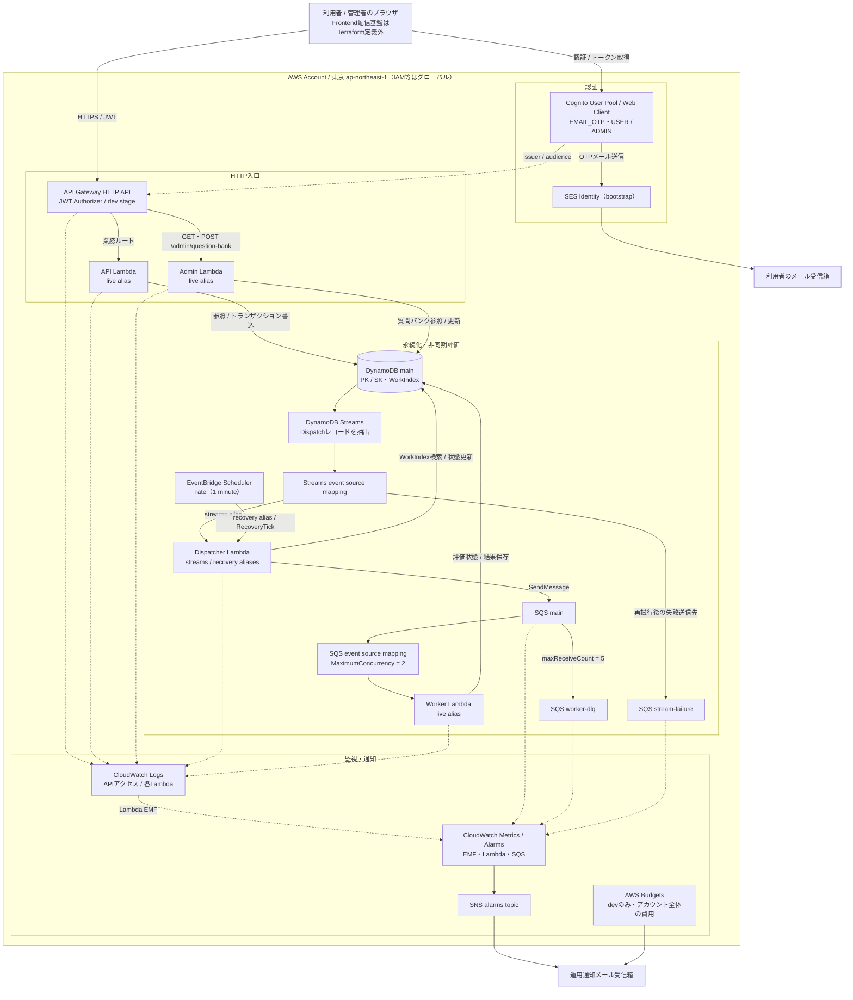
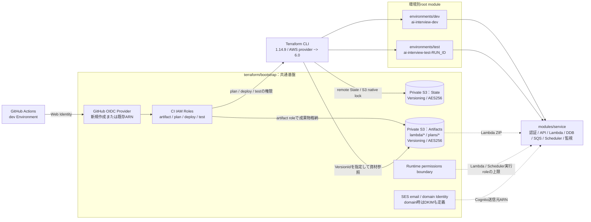

# インフラ構成概要・構成図

作成日: 2026-10-07。参照元は作成時点の `terraform/` 配下の作業ツリー（未コミット変更を含む）。
この資料はTerraformに定義された構成を説明するもので、AWSの現在の配備状態を保証するものではない。今回AWS照会・plan・applyは実施していない。特に専用admin Lambdaなどの追加構成は、配備済みとは扱わない。

## 1. 全体概要

東京リージョン（`ap-northeast-1`）に構成するサーバーレスBackend。Cognitoで認証し、API Gateway HTTP APIのJWT Authorizerを通してAPI用／管理用Lambdaを呼び出す。データはDynamoDBの1テーブルに保存する。

評価処理は、DynamoDB StreamsからDispatcherを起動し、SQSへ配送してWorkerで処理する非同期構成。EventBridge Schedulerから同じDispatcherの回復用aliasを毎分呼び出し、配送・処理状態の回復を行う。CloudWatchでログ・メトリクスを収集し、AlarmをSNSのメール通知につなぐ。

Bootstrapは共通のState／Artifact用S3、GitHub Actions OIDCとCIロール、実行権限の上限を定めるpermissions boundary、SES送信元Identityを管理する。devと実行単位のtestは同じservice moduleを利用する。

## 2. アプリケーション構成図

実線はリクエスト・データ・イベントの経路、点線は認証設定・監視の関係を示す。図は経路が有効な場合の論理構成であり、通常のdev終了状態ではAPI入口・両イベントマッピング・Schedulerを閉鎖する。

Workerの評価Providerは、現行の `backend/src/interview_backend/aws_runtime.py` では `FakeProvider`。TerraformにOpenAI接続、Secrets Manager、OpenAI用WIFの定義はなく、実AI連携済みの構成図にはしていない。

## 3. 主なリソース・設定

| 分類 | 定義された構成・設定 | 参照元 |
|---|---|---|
| 認証 | Cognito ESSENTIALS、メールをユーザー名として使用、管理者のみユーザー作成、MFA OFF。許可する第一認証要素はPASSWORDとEMAIL_OTP | [auth.tf](../terraform/modules/service/auth.tf) |
| Web Client | client secretなし、USER_AUTH／REFRESH_TOKEN_AUTH。Access／ID tokenは5分、Refresh tokenは1日、token revocation有効 | [auth.tf](../terraform/modules/service/auth.tf) |
| 認可 | JWT AuthorizerのissuerはUser Pool、audienceはWeb Client。USER／ADMINグループを作成。管理者グループの業務認可はLambda側で行う | [auth.tf](../terraform/modules/service/auth.tf) |
| HTTP API | 業務7ルート＋JWT必須の`$default`、管理2ルート。OPTIONS 2ルートは認証不要。stage名はdev（testでも同じ）、auto deploy、20 req/s・burst 30、統合timeout 15秒 | [auth.tf](../terraform/modules/service/auth.tf) |
| CORS | 明示originのみ、GET／POST／OPTIONS、Authorization／Content-Type／Idempotency-Key、Allowを公開、credentials false | [auth.tf](../terraform/modules/service/auth.tf) |
| Lambda | api／admin／worker／dispatcherの4関数。Python 3.14、x86_64、512 MB。timeoutはAPI・Admin 15秒、Worker 60秒、Dispatcher 30秒。予約同時実行数は設定しない（-1） | [runtime.tf](../terraform/modules/service/runtime.tf) |
| Lambda配備 | 共通ZIPのS3 key・VersionId・Base64 SHA-256を明示。publishしたversionをaliasへ割当。api／admin／workerはlive、dispatcherはstreams／recovery | [runtime.tf](../terraform/modules/service/runtime.tf) |
| DynamoDB | PAY_PER_REQUEST、PK／SK、WorkIndex（work_pk／work_sk、KEYS_ONLY）、Streams NEW_AND_OLD_IMAGES。PITR無効、TTLなし、AWS所有キーの既定暗号化 | [data.tf](../terraform/modules/service/data.tf) |
| SQS | Standard queueを3本。main保持4日・可視性timeout 360秒・5回受信でWorker DLQへ。Worker DLQ／Stream失敗queueは保持14日。SQS管理暗号化 | [data.tf](../terraform/modules/service/data.tf) |
| Worker mapping | batch 1、batching window 0秒、部分失敗応答、最大同時実行2 | [runtime.tf](../terraform/modules/service/runtime.tf) |
| Streams mapping | TRIM_HORIZON、batch 100、window 0秒、再試行3回、最大record age 1時間、失敗時batch分割、部分失敗応答。NewImage.kind.SがDispatchのレコードだけを対象 | [runtime.tf](../terraform/modules/service/runtime.tf) |
| 回復起動 | Schedulerは毎分、flexible window OFF。Dispatcher recovery aliasへRecoveryTickを送信。再試行3回・最大event age 60秒 | [runtime.tf](../terraform/modules/service/runtime.tf) |
| 実行IAM | Lambda責務ごとのroleとinline policy、共通permissions boundary。DispatcherがStreams読取・WorkIndex検索・SQS送信、WorkerがSQS受信・削除。Adminの質問バンク権限はSYSTEM#QUESTION_BANKに限定 | [iam.tf](../terraform/modules/service/iam.tf) |
| ログ | 各LambdaとAPI Gatewayにlog group。devは7日、testは30日保持。APIアクセスログはrequestId／routeKey／status／responseLength | [runtime.tf](../terraform/modules/service/runtime.tf)、[auth.tf](../terraform/modules/service/auth.tf) |
| 通知 | CloudWatch Alarm→SNS email subscription。SNSへのPublishを同Account・対象prefixのCloudWatch Alarmに制限。メール購読の確認完了はTerraform定義だけでは保証しない | [monitoring.tf](../terraform/modules/service/monitoring.tf) |
| 予算 | devのみ月額USD予算。実績80%／100%、予測100%でemail通知。Projectタグによる絞り込みはなくアカウント全体が対象。例の18.75 USDは設定テンプレート値 | [monitoring.tf](../terraform/modules/service/monitoring.tf)、[settings.example.tfvars](../terraform/environments/dev/settings.example.tfvars) |

## 4. Bootstrap・デプロイ構成図

点線は配備・設定上の関係であり、アプリケーションの実行時通信ではない。

両S3 bucketは公開アクセスを全面ブロックし、TLS以外を拒否、Versioningを有効化、AES256暗号化を指定する。`prevent_destroy=true`、`force_destroy=false`。フロントエンド公開用bucketではない。

CIの信頼ポリシーはOIDCのaudienceと検証済みのdev Environment subjectを固定する。artifact roleは成果物に限定し、plan roleは参照とlock操作、deploy roleはdev更新、test roleはtest資源の作成・検証を担当する。アクセス先はState key・資源名・タグ・permissions boundary等で制限する。

dev／testのroot moduleは空の`backend "s3" {}`を宣言し、backend詳細はinit時に別途指定する。S3 native locking（`use_lockfile=true`）などの運用要件は[Terraform runbook](P4_TERRAFORM_RUNBOOK.md)を参照する。Bootstrap rootにはremote backend宣言がなく、dev／testと同じState管理と推定しない。SES domain検証・DKIMのDNS登録リソースはこのTerraformには含まれない。

## 5. 環境と閉鎖運用

| 項目 | dev | test |
|---|---|---|
| 命名prefix | ai-interview-dev | ai-interview-test-`run_id` |
| 用途 | 継続する開発環境。検証時に一時有効化 | run_id必須の実行単位の検証環境 |
| module | modules/service | modules/service |
| 4つの有効化フラグの既定値 | すべてfalse | すべてfalse |
| ログ保持 | 7日 | 30日 |
| Alarm | 4フラグのいずれかがtrueの間だけ作成 | フラグがfalseでも作成 |
| AWS Budgets | 作成する | 作成しない |

現在の4関数定義では、dev有効時のAlarmはEMF 7件・Lambda Errors／Throttles 8件・DLQ 2件の計17件。testはEMF 27件・Lambda 8件・DLQ 2件・IteratorAge 1件・FailureRate 1件の計39件。これはコードから算出した件数であり、配備済みの件数ではない。HeartbeatとdevのRecoverySweepLagの通知actionはSchedulerの有効状態に連動する。

| フラグ | false時の状態 |
|---|---|
| api_enabled | execute-api endpointを無効化 |
| worker_enabled | SQS→Worker event source mappingを無効化 |
| streams_enabled | Streams→Dispatcher event source mappingを無効化 |
| scheduler_enabled | 回復ScheduleをDISABLED |

閉鎖はリソース全体の削除ではない。DynamoDBのStream自体も有効のままで、消費側のmappingを無効化する。Cognito、DDB、SQS、Lambda version／alias、SNS、IAM、ログ、Artifact、Budget等を保持し、devの4フラグをfalseにすると検証用Alarmは0件になる。

devの検証では、[承認テンプレート](P4_DEV_VALIDATION_APPROVAL_TEMPLATE.md)と[Terraform runbook](P4_TERRAFORM_RUNBOOK.md)に従い、Enablementと条件付き自動Closureを同時承認する。正常なEnablement後は試験のPASS／FAILやinbox未確認にかかわらず、証跡保存とClosureまで完了する。Closureは最新成功applyの入力を基に4フラグだけfalseへ戻し、最新Artifact／version／aliasを維持する。

追加承認なしのClosureは、許可された閉鎖4updateと検証Alarm削除だけであること、create／replaceが0、他のbaselineがno-op、Account／Region・Stateが整合、State外dev resourceとactive lockがないこと等が条件。逸脱やpartial failure時は再apply・手動修復を行わずread-only診断で停止する。性能レビュー待ちを理由にactiveのまま終了しない。

## 6. このTerraformに含まれない構成

- フロントエンド配信のS3／CloudFront／OAC、独自ドメイン用Route 53／ACM。
- VPC／Subnet／NAT Gateway／Security Group／VPC Endpoint。Lambdaには`vpc_config`の定義がない。
- OpenAIの実API連携用Secrets Manager／WIF等。現行Worker runtimeはFakeProvider。
- DynamoDB PITR・TTL、独自KMSキー、X-RayのActive tracing（LambdaはPassThrough）。
- 本番環境root module。環境定義はdevとtestのみ。

これらはTerraformでの未定義範囲を示す。別管理資源の有無や、過去の設計書にある将来構成の配備状況は今回確認していない。

## 7. 定義への入口

| パス | 内容 |
|---|---|
| [terraform/bootstrap/main.tf](../terraform/bootstrap/main.tf) | 共通S3・OIDC・CI role・permissions boundary |
| [terraform/bootstrap/ci-policies.tf](../terraform/bootstrap/ci-policies.tf) | State／Artifact／環境資源に対するCI権限 |
| [terraform/bootstrap/identity-policies.tf](../terraform/bootstrap/identity-policies.tf) | API Gateway／Cognito／Budget関連のCI権限 |
| [terraform/bootstrap/ses.tf](../terraform/bootstrap/ses.tf) | 送信元Identity・domain DKIM |
| [terraform/environments/dev/main.tf](../terraform/environments/dev/main.tf) | dev backend／provider／service呼出 |
| [terraform/environments/test/main.tf](../terraform/environments/test/main.tf) | test backend／provider／run_id付きservice呼出 |
| [terraform/modules/service/variables.tf](../terraform/modules/service/variables.tf) | 入力制約・名前・環境判定・有効化フラグ |
| [terraform/modules/service/outputs.tf](../terraform/modules/service/outputs.tf) | manifest v3：構成・資源ID・version／alias・Artifact識別情報 |

manifestにAPI endpointが出力されていても、入口が有効とは限らない。有効状態はconfigurationのフラグとAWS読戻しで別途確認する。
