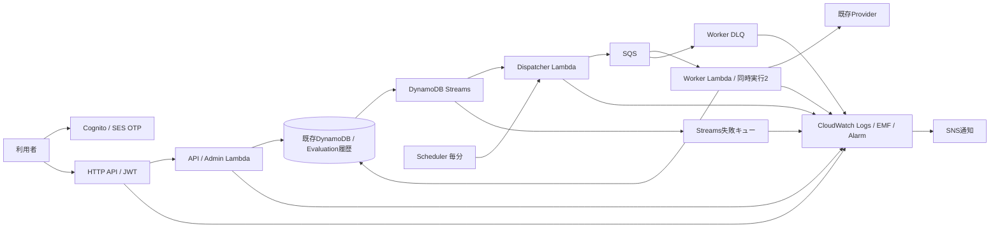

# P4 AWSインフラ：コスト最適化・ログ管理改善計画（最終レビュー版）

更新日：2026-10-09。状態：Codex Cloud実装・オフライン検証済み。AWS配備は別承認待ち。実行結果は[Windows引き継ぎ](P4_COST_LOG_WINDOWS_HANDOFF_20261009.md)を正本とする。

## 0. 最終判断とレビュー範囲

推奨は**Phase 1＋Phase 2**。既存サーバーレス構成、Worker同時実行2、毎分Recovery、SQS再試行／DLQ、DynamoDBオンデマンド、認証／IAMを維持する。用途別の全5 Log Groupを開発専用・testは3日、実利用者向けは14日とし、既存Evaluationを90日以上の問い合わせ情報として利用する。TTL、履歴テーブル、ログ掃除Lambda、新しい監視基盤は追加しない。

30人×20評価／月、dev常時稼働のモデルは現行 **$5.11→推奨$5.61／月**、常設無料枠が十分残る条件では **$1.12→$1.62／月**。追加約$0.50は業務失敗・滞留を見逃さないための4Alarm／5参照であり、削減とは呼ばない。testの不要なAlarmを止める効果は**安全に削除できた実際の残存時間**だけで計算する。残存が0hなら節約0、24hなら$0.14、168hなら$0.98（devと同一Account）。丸1か月残す実態は未確認。

旧版の$5.27は6Alarm追加と、未実測のcustom3系列停止／EMF bytes削減を同時に織り込んでいた。最終版は追加を4件に減らし、未実測の削減をPhase 3へ延期したため、無料枠消費済みの推奨額は旧版より上がる。**費用を減らせる実測根拠がない部分を楽観的に差し引かない。** Phase 1だけなら顧客devは約$5.109、開発専用devは約$5.108で、監視は現行17件のまま。顧客公開の完了案はPhase 2までとする。

必須の実装工数は旧6～10人日から**3～5人日（Phase 1：1～2、Phase 2：2～3）**へ見直す。DDBモデル変更、EMFバッファ、独立監視profile、新しいtest実行基盤は必須範囲から除外する。実AI30人の性能検証・既存cold-start不合格の解決、実AWS配備／待ち時間は別工程。

これは請求実績ではなくモデル概算。前回レビューの公式リンク・料金モデルを維持した。今回Cloud shellからの公式ページ取得はHTTP403、代替のブラウザ経由でCloudWatch・Free Tierの課金仕様を再確認した。Tokyoの動的全SKUは未取得。東京リージョンの全SKU単価、実ログ量、現在の無料枠／請求は未取得。完全無料と30人同時性能の合格は保証しない。根拠・仮定・未確認を以下に分ける。

| 監査対象 | 確認状態 |
|---|---|
| ローカルGit | 実装元 `b9ec1f7b02374639ff8eb7310e978b5950565757`。作業branch `codex/p4-cost-log-optimization-20261009`。成果commitは引き継ぎ参照 |
| remote | `origin=https://github.com/yonegen0/ai_interview.git`。開始時fetch・祖先確認でorigin/mainと実装元HEAD一致、ahead/behind 0/0。Push後の確認は引き継ぎ参照 |
| working tree | 既存変更の`docs/INFRASTRUCTURE_OVERVIEW.md`を維持し、今回commitへ含めない。対象のBackend・Terraform・試験・文書のみ変更 |
| AWS／State | 今回AWS操作0。現稼働、test残存時間、State／drift、Artifact／alias、無料枠残量、請求未取得 |
| ローカル検証 | Backend pytest／Ruff、Terraform fmt・4root validate・mock49件、Frontend・ZIP検証。詳細／未実施は引き継ぎ参照。実State planは未実施 |

本資料A章・現行費用は実装元commitの基準値、B～F章は承認された設計と配備時の受入条件を示す。Cloud実装は次項を参照。AWS／State／権限／既存CI workflowは変更していない。Git commit・専用branchへの通常pushは今回許可された作業で、main merge・AWS applyは含まない。

### 0.1 Cloudで実装した範囲

| Phase | 実装 | 料金前提／影響 | 残る受入条件 |
|---|---|---|---|
| 1 | `log_usage=developer/customer`、全5group3/14日、dev入力必須、moduleの省略時customer14日。旧Log Group名・resource address維持。既存Evaluationを読むowner指定private問い合わせsummary | 顧客14日は基準より保存増。新DDB item／TTL／table／cleanupサービス0。保存だけの削減は僅少 | 短縮前証跡保全、実plan replace0、既存データ／バックアップ／ユーザー削除方針を確認 |
| 1 | test監視はdefault継続。全4入口閉鎖・明示確認時のみ0Alarm、再開時39へ復帰。読取り専用のqueue/DLQ/WorkIndex drain補助 | 実際に消えた不要残存時間だけ42参照の課金が減る | 専用testで39件を維持したままdrain、全writer停止・未解決障害解消、2観測は近似値／GSIのため完全保証でない。新鮮なmanifest hash付き証跡を再照合して別saved planを承認 |
| 2 | 顧客devだけ追加4Alarm／5参照。PendingAge>120、QueuedAge>120、HTTP API 5xx>=1、Worker＋Dispatcher EvaluationFailed合計>=1。各60秒・1期間・missing notBreaching。既存17とSNS維持 | $0.50／月増、既存custom系列を再利用し新しいEMF名／dimensionを増やさない | 実機fault通知・SNS受信確認、顧客dev21件22参照、閉鎖0 |
| 2 | manifest4、schema2/3の旧保持日数／readback互換、新入力を承認bindingに含める。相関ログは受付・配送・Worker claim・終端・エラーのみ。HTTP accessログに時刻・latency追加 | 新コードは正式新Artifactが必要。DB追加read/write0、SQS形式変更0、ログ増4KB/評価の仮定を維持 | 別承認の新ZIP/version/alias・provider確認、秘匿化／相関を実機確認 |
| 3 | 健全なGET pollingの重複通常ログを抑制し、EMF／アクセスログを維持。初期化失敗のtest環境帰属を補正 | 削減bytes・金額未実測。CSVで架空の削減を差し引かない | 実取り込みbytesを観測。既存EMFの未使用候補3系列の停止／バッファは保留 |

問い合わせsummaryは既存Evaluationのowner、評価／attempt ID、日時、状態、分類、処理時間、既知のProvider／modelだけを抽出する。userIdはprivate成果物のみで通常ログに出さない。古いrecordにprovider情報がなければunknownとし、履歴を推測で補完しない。requestIdは14日ログでの相関に利用し、既存recordへ二重保存しない。既存recordが存続すれば120日後でも参照可能なoffline試験を追加した。**90日以上のAWS実保存、退会／管理者削除、バックアップRPO/RTOは未検証であり、保証済みとはしない。** 回答・採点結果・処理recordへのTTLは禁止のまま。

既存Closure実行器は変更しない。4update＋承認済みAlarm delete・その他baseline no-opの監査をschema4でも試験し、retention変更の混入を拒否する。保持変更・新Artifact配備はClosureから分離する。新test監視gateは自動cleanup実行器ではなく、AWSのdrainを確認せずboolだけ変更する運用は禁止する。

工数3～5人日は旧計画の工程見積で、Cloudで消費した実人日を意味しない。Windowsに残る作業は実機証跡を収集する配備・検証工程で、権限やState状況により時間が変わる。今回の工数を制約に監視・試験を省略していない。

## A. 現状分析

### A1. AWS構成と課金要因

| サービス | コードから確認した構成 | 課金・運用上の要点 | 根拠 |
|---|---|---|---|
| Lambda | API／Admin／Worker／Dispatcher、Python3.14、x86_64、512MB、予約なし。timeout15／15／60／30秒 | 要求数・課金GB秒。Provisioned Concurrency／provisioned pollingなし。ログや更新時のInitも実測課金時間に含めて再計算する | [runtime.tf](../terraform/modules/service/runtime.tf) |
| HTTP API | JWT必須の業務7＋default、管理2、OPTIONS2。stageはtestも`dev`。20RPS／burst30 | API要求、データ転送。ルート別詳細メトリクスは有効化していない | [auth.tf](../terraform/modules/service/auth.tf) |
| Cognito／SES | ESSENTIALS、メールOTP、USER／ADMIN、管理者ユーザー作成、Access／ID5分、Refresh1日 | Cognito MAUとSESメールは別料金。ESSENTIALSをLiteへ変更するとOTP要件を損なう | [auth.tf](../terraform/modules/service/auth.tf)、[ses.tf](../terraform/bootstrap/ses.tf) |
| DynamoDB | PAY_PER_REQUEST、単一テーブル、PK／SK、KEYS_ONLY WorkIndex、NEW_AND_OLD_IMAGES Streams | 強整合読取り・トランザクション・1KB／4KB単位丸め・GSI更新も課金。容量制限は提案しない | [data.tf](../terraform/modules/service/data.tf)、[dynamodb.py](../backend/src/interview_backend/repositories/dynamodb.py) |
| SQS | main4日、visibility360秒、5回受信でWorker DLQ。DLQ／Streams失敗キュー14日。管理暗号化 | 空ReceiveMessageも要求数。最大同時数2を設定すると低負荷時のpoller縮小最適化が使えない。上限制御を外す理由にはしない | [data.tf](../terraform/modules/service/data.tf)、[runtime.tf](../terraform/modules/service/runtime.tf) |
| Streams mapping | batch100、retry3、最大age1時間、batch分割、部分失敗応答、Dispatch NewImageだけ | DynamoDB変更が発生すると起動。完了後のDispatch更新にもStreamsイベントが出得る。Lambda triggerのGetRecordsは通常無料 | 同上、[events.py](../backend/src/interview_backend/evaluation/events.py) |
| Scheduler | 毎分、Dispatcher recovery alias、retry3、最大age60秒 | Scheduler自身だけでなくLambda・DDB・EMF・ログが発生。停止中はこれらの新規利用を抑えられる | [runtime.tf](../terraform/modules/service/runtime.tf) |
| CloudWatch | Lambda4＋Gateway1の計5 Log Group。EMF、標準メトリクスAlarm | 保存よりAlarm、EMFのメトリクス時間、ログ取り込みが主な最適化対象 | [monitoring.tf](../terraform/modules/service/monitoring.tf)、[observability.py](../backend/src/interview_backend/observability.py) |
| SNS | Alarm topic＋email subscription、同Account／prefixにPublish制限 | Publishとメール配信。通知到達・購読確認は未確認。topicだけで大きな固定料金にはならない | [monitoring.tf](../terraform/modules/service/monitoring.tf) |
| S3 | State／Artifact各1、Versioning、AES256、public block、TLS強制、prevent_destroy | 非現行versionやZIP／saved plan／private証跡が累積。Frontend用ではない。誤削除は配備・復旧を壊す | [main.tf](../terraform/bootstrap/main.tf) |
| IAM／WIF | GitHub OIDC、CI4role、責務別runtime role、boundary。Worker WIFは条件付き、既定false | 一般IAM資源に固定費を置かない。新しいoutbound WIFの適用条件・関連課金は別確認、勝手に有効化しない | [wif.tf](../terraform/modules/service/wif.tf)、[bootstrap/wif.tf](../terraform/bootstrap/wif.tf) |
| Budgets | devのみアカウント全体の費用通知、実績80／100%、予測100% | 通知のみのBudgetは公式上無料。課金停止の仕組みではない。Reports／Actionsは未定義 | [monitoring.tf](../terraform/modules/service/monitoring.tf) |

VPC、NAT、ALB、EC2、RDS、DAX、独自KMSキー、Secrets Manager資源、Frontend配信用CloudFront／S3／Route53／ACM、本番root moduleはこのTerraformにはない。別管理資源を不存在とは断定しない。Lambda tracingはPassThroughで、X-Ray Active tracingは未設定。

### A2. ログの実装

| Log Group | dev | test | 記録される情報／不足 |
|---|---:|---:|---|
| `/aws/lambda/<prefix>-api` | 7日 | 30日 | EMF ApiRequest／ApiDuration／ApiFailure等。START／END／REPORT等のLambdaシステムログ。Gateway requestIdとの明示的な関連なし |
| `/aws/lambda/<prefix>-admin` | 7日 | 30日 | ApiEntry共通のEMF。管理操作の詳細はQuestionBankChangeを参照。通常ログに管理者sub／bodyは出していない |
| `/aws/lambda/<prefix>-worker` | 7日 | 30日 | 成否／latency等EMF、ProviderFailureの固定分類WARNING。評価IDやLambda requestIdを含む構造化terminalイベントなし |
| `/aws/lambda/<prefix>-dispatcher` | 7日 | 30日 | SweepLag／Heartbeat等EMF。配送／回復対象の評価IDを結び付ける通常イベントなし |
| `/aws/apigateway/<prefix>` | 7日 | 30日 | requestId、routeKey、status、responseLengthのみ。responseLatency、integration requestId／latency、時刻の明示フィールドなし |

`logging_config`、applicationのDEBUG／INFOレベル設定はTerraformにない。大量DEBUG／回答全文を吐くログはruntime範囲の検索では見つからない。`demo.py`や検証用CLIのprintをLambda通常ログと混同しない。

EMFは`print`に直接出すため、Python loggerのレベルをWARNINGにしても削減されない。1メトリクス1JSONなのでAPIの正常1呼出で通常2件、正常Recoveryでは3partitionのSweepLag＋Heartbeatで通常4件出る。大量ログという請求上の事実は未測定。例外は安全な分類に変換され、生SDK例外や認証情報を通常ログへ出さない設計を維持する。

### A3. Alarm件数・作成条件・検知の穴

| 環境・状態 | EMF | Lambda Errors／Throttles | DLQ | IteratorAge | FailureRate | Alarmオブジェクト | 課金metric参照 |
|---|---:|---:|---:|---:|---:|---:|---:|
| dev・全4フラグfalse | 0 | 0 | 0 | 0 | 0 | **0** | **0** |
| dev・いずれかtrue | 7 | 8 | 2 | 0 | 0 | **17** | **17** |
| test・全4フラグfalse | 27 | 8 | 2 | 1 | 1 | **39** | **42** |
| test・稼働中 | 27 | 8 | 2 | 1 | 1 | **39** | **42** |

testのFailureRateはWorker／DispatcherのCompleted／Failedの4metricを参照するため、39件≠39課金単位。Alarmは存在時間で課金され、`actions_enabled=false`だけでは課金を止められない。devのHeartbeat／SweepLag通知actionはSchedulerに連動。testのSweepLagは現状閉鎖時もaction有効、IteratorAge actionはStreams flagに連動する。

根拠：[monitoring.tf](../terraform/modules/service/monitoring.tf)、[manifest_alarms.py](../backend/skills/p4/manifest_alarms.py)、[serverless.tftest.hcl](../terraform/modules/service/tests/serverless.tftest.hcl)。テストのassertは17／39件だが、一部error_messageは旧14／32件のままなので文言も後続修正対象。

**実利用者を無人で受け入れるdevに17件をそのまま十分と判断しない。** APIは例外を500レスポンスに変換するためLambda Errorsが増えない場合がある。WorkerはProvider失敗をEvaluationFailedとして保存し正常終了する場合がある。部分batch失敗もLambda Errorsだけでは網羅できない。devにはApiFailure／EvaluationFailed／PendingAge／QueuedAge／ExpiredLease／DeadlineOverdueのAlarmがなく、正常Lambda終了と業務成功は同じではない。既存17件を削るのでなく、実利用者向けに検知を補完する（§B3）。追加は4件／5参照へ絞り、ExpiredLease／DeadlineOverdueの専用Alarm追加は重複検知の検証結果を条件に保留する。

### A4. EMF・Dimension

Namespaceは`AIInterview`。Dimension setは1つだけ、`[Project, Environment, Component]`。Projectは1値、Environmentはdev／testの2値、Componentはapi／admin／worker／dispatcherの4値。requestId、userId、evaluationId、run_id、関数名、provider IDをDimensionにしていない。

allowlistは**28メトリクス名**：

```text
ApiRequest ApiFailure Unauthorized InvalidConfiguration InvalidEvent
InternalInvocationFailed WorkerBatchFailure StreamBatchFailure DBError
IntegrityError MissingEvaluation RecoveryHeartbeat RecoveryBudgetStop
RecoveryCursorConflict RecoveryPartitionBlocked ExpiredLease DeadlineOverdue
OutcomeUnknown EvaluationCompleted EvaluationFailed DuplicateSuppressed
LostLease DeliveryFailure ApiDuration EvaluationLatency PendingAge QueuedAge
RecoverySweepLag
```

コード上の組合せ上限は28×4＝112系列／環境、2環境なら224。ただし全componentから全metricを発行する実装ではないので、これは課金数ではない。発行した系列と発行した時間で再集計する。正常パス・障害時のみの系列・未発行系列を分ける。Alarm定義があるだけでcustom metricの発行料金が生じるとは扱わない。

高カーディナリティは現状防げている。一方、異なる`run_id`のtest環境は同じDimensionへ集約されるため、同時testのHeartbeatが別runの障害を隠したり、成否を混ぜたりし得る。run_idを新Dimensionに追加するのではなく、完全service testの排他実行を既存CI concurrencyと運用guardで要求する。

初期化失敗時の`_invoke`は`Metrics(component)`の既定devを使うためtestのInvalidConfigurationがdevに誤帰属する候補。将来prodもMetricsのallowlist／環境選択の変更が必要。これらは監視の正確性を改善するPython計画に含める。

### A5. DynamoDBの履歴と問い合わせ対応

全レコードは`kind`、`schema_version`、`rev`、JSON文字列`data`を持つ。[codec.py](../backend/src/interview_backend/repositories/codec.py)は厳密にdecodeする。

| kind／キー | 保存する内容 | 問い合わせへの再利用 |
|---|---|---|
| Session：`USER#sub / SESSION#id` | 問題snapshot、active attempt、作成／更新時刻、質問バンクversion | Session／Attempt／Evaluationの関連 |
| Attempt：`USER#sub / ATTEMPT#id` | session_id、evaluation_id、質問、回答、created_at | 回答受理と対象評価の確認。回答を運用ログへコピーしない |
| Evaluation：`USER#sub / EVALUATION#id` | attempt_id、created_at、deadline_at、finished_at、status、failure_reason、call_started_at、execution_config、feedback等 | 主な問い合わせ情報は既存保存済み。処理時間はfinished−createdで導出 |
| Dispatch：`USER#sub / DISPATCH#id` | 評価と同じID、generation、状態、queued_at、配送回数、lease関連 | 配送／再送／待ち行列の状態 |
| AttemptCoaching：`USER#sub / COACHING#id` | 会話履歴、現在／前回評価ID、進捗 | コーチング回と評価の対応。重複保存を増やさない |
| IdempotencyRecord | request hash、reply、created_at、利用者／key | 重複依頼／再送の診断。TTLで消すと冪等保証が変わる |
| QuestionBank／QuestionBankChange | `SYSTEM#QUESTION_BANK / CURRENT`と`OP#owner#key`、更新者、時刻、変更ID、reply | 管理変更履歴。回答データとは別 |
| ProviderUsage | 利用者別／globalのUTC月呼出回数 | OpenAI利用制限。月次の呼出数でありトークン請求額ではない |
| RecoveryCursor | `SYSTEM#RECOVERY / CURSOR#partition` | 回復進捗。問い合わせ履歴として複製しない |

通常APIはJWT subをownerとして使い、ownerとIDから読み取る。SQS内部イベントにはownerSub／evaluationId／dispatchVersion、leaseにはexecution_idがある。**execution_id、API Gateway requestId、Lambda aws_request_idは別物**。現状、後者2つをEvaluationに耐久保存していない。evaluationIdだけをキーに全利用者をScanする調査は採用しない。

TTL設定なし、PITR無効、オンデマンドバックアップ／AWS Backupの定義なし。通常ドメイン処理に期限によるデータ削除は見つからない。`cleanup_exact.py`は明示承認付きの対象キー削除ツールで、通常の保存期限管理ではない。生データを90日で削除してよいという承認はない。

### A6. ライフサイクル・既存運用の制約

devの初回CIは全4フラグfalseを必須とする。検証は承認されたsaved planに限定し、Enablement成功後は成否にかかわらず条件付きClosureまで行う。Closureは最新Artifact／version／aliasを保持し、4update＋承認済みAlarm削除だけを許す。

`closure_adapter.py`には61＋承認Alarm数のbaseline検査などがあり、古い設計資料の50resourceを現HEADのbaselineと混同しない。現時点のAWS Stateの資源数は未確認。ログ保持変更／新監視profile／Python変更を既存Closureへ混入させてはいけない。

完全serviceのtest rootと、`p4-dynamodb.yml`の実DBテストは別経路。後者は`interview-p3-test-*`の一意テーブルをpytest fixtureで作成し、finallyでそのテーブルだけ削除しjournalを残す。runner強制終了やcreate応答喪失ではfinallyだけでcleanupを保証できない。完全service testの閉鎖後Alarm削除を保証するCIは調査範囲で見つからない。

根拠：[AGENTS.md](../AGENTS.md)、[runbook](P4_TERRAFORM_RUNBOOK.md)、[closure_adapter.py](../backend/skills/p4/closure_adapter.py)、[ci_dynamodb.py](../backend/skills/p4/ci_dynamodb.py)、[conftest.py](../backend/tests/conftest.py)。

## B. 改善後の推奨構成



構成図のAWS実装は現行のまま。以下は設定・観測・運用手順の変更計画で、新規サービス追加ではない。

### B1. 用途で決める3日／14日保持（Phase 1）

| 利用目的 | 保持日数 | 入力案 |
|---|---:|---|
| 開発者のみのdev | 3 | `log_usage="developer"` |
| 合成データを使うtest | 3 | 同上 |
| 実利用者を受け入れるdev／その他環境 | 14 | `log_usage="customer"` |
| 将来prod | 14 | customer固定の別rootを用意する時に強制 |

service moduleでenum `log_usage`から`retention_in_days = customer ? 14 : 3`を一度だけ算出し、API／Admin／Worker／Dispatcher／Gatewayの全5groupで共有する。dev rootは用途を必須入力、testはdeveloper既定、module単体の未指定はcustomer14日という安全側にする。**環境名だけで用途を推測しない。** 将来の監視選択にもこの用途入力を再利用し、独立した`monitoring_profile`は追加しない。

resource address／name／Standard classを維持しin-place更新する。Log Groupの再作成と削除用Lambda／Schedulerは不要。manifestのconfigurationは現行で厳密なキー集合を検査しているため、最小限の新契約（schema 4：用途／retention／test監視設定の証跡）を検討する。旧schema 2／3は旧7／30日として読取り、既存receiptを書き換えず、未知キーを無条件許可する回避策も採らない。これは配備証跡の互換対応で、DDB schema変更ではない。

短縮前に未解決問い合わせ・承認証跡を確認し、必要な最小抽出を既存private evidenceへ保全する。消去済みログは日数を戻しても復元しない。[CloudWatch retention](https://docs.aws.amazon.com/AmazonCloudWatch/latest/logs/Working-with-log-groups-and-streams.html)、[Terraform Log Group](https://registry.terraform.io/providers/hashicorp/aws/latest/docs/resources/cloudwatch_log_group.html)。EMF抽出後のメトリクス保持はLogsと独立しているが、REPORTや詳細ログによる調査窓は短くなる。test合否・必要統計は3日以内に既存証跡経路へ保存する。

### B2. 90日以上の問い合わせ対応：既存DynamoDBを正本にする（Phase 1／2）

既存`USER#sub / EVALUATION#id`のowner、評価ID、依頼・完了時刻、status、failure_reason、execution_configのprovider/modelを使用し、elapsedはfinished−createdから計算する。Session／Attempt／Dispatchとの関連も既存キーで確認する。未開始失敗などprovider未記録はunknownとし、推測で埋めない。

**90日は問い合わせ対応の最低目標であり、削除日ではない。現行はTTLなしで保存継続する。** 回答・採点結果、Coaching、冪等記録、Dispatch、RecoveryCursor、ProviderUsageなど処理に必要なレコードへTTLを設定しない。評価に運用属性を混ぜてレコード全体をexpireする案、運用履歴の二重保存、新テーブル、全件backfillも採用しない。[TTLはitem全体を削除する仕様](https://docs.aws.amazon.com/amazondynamodb/latest/developerguide/TTL.html)。

Phase 1は本人確認＋owner／evaluationIdによる既存読取りの運用手順を整える。Phase 2は14日内の詳細調査用に通常ログのrequestId↔evaluationId相関を補う。14日以降はDDBの管理項目だけをallowlistで抽出し、問い合わせ元へ回答する。90日超でも現行データが残る限り同じ手順を使える。ただし古いAPI Gateway requestIdしかない問い合わせの完全な相関はできず、本人確認と評価日時／評価IDが必要という制約を案内する。

Gateway requestId／Lambda aws_request_idの永続化は**必須範囲から除外**する。既存`operational_context`追加案はPhase 3の実需要がある場合だけ再検討する。公開検索API、新管理UI、cross-user Scan／新権限を追加せず、既存の本人データアクセス境界を維持する。問い合わせに回答全文やfeedback本文を重ねて収集しない。

### B3. 最小限の追加監視（Phase 2）

現行稼働dev17件をすべて残し、customer用途でのみ以下4件／5課金参照を追加する。閉鎖devは現行どおり0。testは検証中の39件／42参照を維持する。

| 検知 | 最終判断 | 参照／月額増分 | 既存との違い／代替の可否 |
|---|---|---:|---|
| API／Adminの500 | API全体の標準`AWS/ApiGateway:5xx`を1件追加。Sum>=1、60秒、missing=notBreaching | 1／+$0.10 | catchされた500はLambda Errorsに出ない。独自ApiFailure Alarmやroute詳細metricを追加する必要はない |
| 業務評価失敗 | 既存Worker／Dispatcher `EvaluationFailed`のSUMを1件追加。FILL=0、>=1、60秒 | 2／+$0.20 | Provider失敗は正常Lambda終了し得る。既存testの4参照failure ratioは10件未満で検知しないため、そのコピーを避ける。custom系列の新設は不要 |
| PendingAge／QueuedAge | 既存EMFで各1件追加。Maximum>120秒、60秒、missing=notBreaching | 2／+$0.20 | Heartbeatは回復関数が動いた証拠で個別滞留の保証ではない。SQS OldestMessageは未配送のPENDINGを見ず、完全代替できない |
| ExpiredLease／DeadlineOverdue | 専用2件の追加を保留。既存metric自体・testの既存Alarmは維持 | 0 | started lease失効は既存OutcomeUnknown＋EvaluationFailed、期限超過のterminalはEvaluationFailed、回復停止はHeartbeat／SweepLag、再配送滞留はAgeで検知。独立2period Alarmより早い／同等の検知をfault testで確認する条件付き判断 |
| Batch／DB失敗・DLQ | 既存Errors／Throttles／Integrity、DLQ、回復、追加Age／Failedの組合せを検証 | 0 | 分類別Alarmを機械的に増やさない。失敗が続いても通知されない経路が残れば追加を承認対象に戻す |
| 完了数／latency／API Count | EMF維持。標準Count／Latency／IntegrationLatencyとの比較のみ | 0 | 標準と独自durationの計測範囲は違う。性能Gateの母集団を置換しない |
| 合計 | **customer21 Alarm／22参照** | **+$0.50／720h** | 既存17件を削らず、既存EMF系列を使う |

API標準メトリクスと追加料金のかかるroute詳細の区別は[HTTP API公式仕様](https://docs.aws.amazon.com/apigateway/latest/developerguide/http-api-metrics.html)を根拠とする。SNS購読確認・到達まで検証する。Alarm名／threshold／missing data／actionsの正確な集合を新manifestと承認scopeへ束縛し、過去の17件承認を流用しない。

**専用Alarm保留は実装受入の条件付きであり、検知が十分と確定したわけではない。** pre-call lease失効、started lease失効、terminal保存失敗、deadline超過、empty queueなのにPENDING残留、Recovery停止、partial batch、DLQをfault testする。繰り返し障害が既存＋追加の組合せで既定の検知時間内に通知されないなら、未解決として公開を止める。必要な2専用Alarmを戻す場合はさらに+$0.20／月、23件／24参照で再承認する。費用のため障害経路を捨てない。

### B4. 取り込み量・EMF・custom metric（Phase 2／3）

Phase 1／2は既存28メトリクス名、Dimension `[Project, Environment, Component]`、EMFイベントを維持する。requestId／userId／evaluationId／run_idをDimensionにしない。正常Recoveryは毎分4EMFのままで、新しい正常tick詳細ログは加えない。

Phase 2の通常ログは必要なイベントへ絞る。API／Adminは受理・失敗の固定分類とroute、Gateway requestId、Lambda requestId、取得済み評価ID、status／elapsed。Workerはterminal結果、評価ID、Lambda requestId、provider、固定failure分類。Dispatcherは配送／回復の**状態が変わった時だけ**対象ID・分類を記録する。API Gatewayは時刻・responseLatencyなど対応するcontext項目を最小限追加する。[HTTP APIログ変数](https://docs.aws.amazon.com/apigateway/latest/developerguide/http-api-logging-variables.html)。integration requestIdとLambda requestIdを未検証で同一視しない。各API呼出の二重DEBUG／INFOやbodyの記録を追加せず、評価あたり追加4KBを仮定する。

allowlistを使い、通常ログへメール、ownerSub、回答／質問全文、feedback、JWT、API key、headers、raw SQS／DDB image、生SDK例外を出さない。IDも形式・長さを検査する。ログ失敗で業務処理をretryさせず、新しいDDB読書きは増やさない。起動失敗時のtest→dev誤帰属を同時に修正する。

Phase 3で初めて、未参照のApiRequest／ApiDuration／EvaluationLatencyの通常ログ化や、invocation内EMF集約を比較する。集約だけではunique系列数が減らない。正常系列3停止の30人モデル削減上限は約$0.509／月（枠ありではほぼ0）。現段階でこのために1～2人日のバッファ・flush・feature flag・統計互換実装を追加する費用対効果は低い。実測で支配的になるまで保留し、Phase 1／2料金から差し引かない。障害／Heartbeat／Ageの削除・間引きは提案しない。

### B5. testの安全な後片付け（Phase 1）

提案input `test_monitoring_enabled`は既定true。全4flag=falseだけを「未使用」の証明にしない。直接Lambda呼出／実DB試験の可能性があるため、検証終了、in-flight終了、queue／未解決評価の確認、receipt／journal保存をした**検証済み閉鎖**の場合だけfalseを許す。Terraformのpreconditionでactive+falseを拒否し、実行器のreadbackで残処理／不明状態を拒否する。EMF AlarmだけでなくIteratorAge／FailureRateを含む39件すべてに同じgateを適用する。

未解決DLQ／失敗／drift／読取り不能ならAlarmを残し、節約を保留する。再開はAlarm・SNS準備→処理有効化の順。既存CI／runbook／journalを使い、掃除Lambda、新Scheduler、新しい全環境destroy runnerは作らない。完全service testの既存経路が見つからない部分は最小の手動承認手順を明記し、自動化完成を装わない。自動閉鎖の組込みは経路を確認してから、現承認運用に沿って行う。

`p4-dynamodb.yml`のfixtureテーブルは別管理で、既存finally cleanupを維持する。強制終了の未削除候補はjournalで検出しexact name／account／region／runを突合して判断する。タグによる一括削除や保護データのpurgeは行わない。State、Artifact、saved plan、S3非現行version、Lambda旧版の無条件削除も採用しない。

## C. コスト比較・料金シミュレーション

### C1. 公式情報と単価の確度

2026-10-09に現行の公式料金・無料枠ページを確認し、最終レビューでもCloudWatch、Lambda、HTTP API、DynamoDB、SQS、Scheduler、Cognito、SES、Free Tierの仕様を再確認した。USD、税／為替／割引／credit適用前。下の東京想定単価のうち「仮置き」は最新SKU値を取得済みと扱わない。実装前の見積確定では既存の許可された接続からPrice List／Calculatorのap-northeast-1を再確認する。追加アクセス権を今回求めたり付与したりしていない。

| 項目 | モデル単価 | 確認状況／公式根拠 |
|---|---:|---|
| Lambda requests／x86 GB秒 | $0.20／百万、$0.0000166667／GB秒 | 現行公式の通常料金例で確認。東京SKUのsnapshot未取得：[Lambda](https://aws.amazon.com/lambda/pricing/) |
| HTTP API | $1.00／百万 | 現行公式例で確認。東京の動的表未取得：[API Gateway](https://aws.amazon.com/api-gateway/pricing/) |
| DDB WRU／RRU／Standard storage | $0.7425／百万、$0.1485／百万、$0.285／GB月 | **東京単価の仮置き**。現行公式ページの容量・丸め・無料枠・Streams規則を確認したが地域別値未取得：[DynamoDB](https://aws.amazon.com/dynamodb/pricing/) |
| SQS Standard | $0.40／百万 | 東京単価仮置き。現行公式で空要求含むaction・64KB単位・無料枠を確認：[SQS](https://aws.amazon.com/sqs/pricing/) |
| Scheduler | $1.00／百万 | 公式例と毎月14M無料を確認：[EventBridge](https://aws.amazon.com/eventbridge/pricing/) |
| CW Logs ingestion／storage | $0.76／GB、$0.033／GB月 | 東京を明示した[AWS構成料金例](https://aws.amazon.com/jp/cdp/ec-container/)は2024年時点の例。最新東京SKUとしては**仮置き**。現行[CloudWatch](https://aws.amazon.com/cloudwatch/pricing/)の無料枠・課金方式を確認 |
| CW standard Alarm／custom metric | $0.10／参照metric月、$0.30／metric月 | 現行公式例で確認。ただし例はUS East、東京の動的表未取得。同上。時間按分 |
| Cognito Essentials | $0.015／課金MAU | 現行公式で確認：[Cognito](https://aws.amazon.com/cognito/pricing/) |
| SES outbound | $0.10／千通＋$0.12／GBの追加データ | 現行表はattachment dataを記載し、料金例はoutgoing mail dataを計上。全メール4KBを追加データとして見込む保守的仮定で、実課金bytes／有料plan選択は未確認：[SES](https://aws.amazon.com/ses/pricing/) |
| S3 Standard／PUT／GET | $0.025／GB月、$0.0047／千、$0.00037／千 | **東京単価仮置き**。保存・要求・version管理の課金を確認：[S3](https://aws.amazon.com/s3/pricing/) |
| SNS Publish／email | $0.50／百万、$2／千配信 | **単価仮置き**、配信方式による課金を確認：[SNS](https://aws.amazon.com/sns/pricing/) |
| Internet egress | $0.114／GB | **東京単価仮置き**。API／OpenAI向け送信を別に数量化。無料transferは共有 |
| Budget／IAM | 今回の通知のみBudget／通常IAM資源を$0 | [Budgets](https://aws.amazon.com/aws-cost-management/aws-budgets/pricing/)。WIF固有の費用は未確定で追加不確実性に残す |

単価差がある時はCSVの数量に新単価を乗じて再計算する。表を請求保証に使わない。計算精度と見積の確度は別で、表示は小数2桁に丸める。


東京のCloudWatch／DynamoDB地域別Price List JSONも公式URLから取得を試みたが、調査ツールでは取得できなかった。**最新公式の課金仕様を確認したことと、全地域単価を確定したことを区別する。** 未取得の単価を「最新東京実額」として保証しない。

### C2. 数量仮定・実測できる項目

請求／月間実測データは未取得。既存[性能分析](P4_DEV_PERFORMANCE_ANALYSIS_20261006.md)のFake120評価完了、DLQ0等は限定試験の事実だが、実AIの課金時間ではない。同資料の1秒分散cold API p95=2003.466msは正式2秒GateにFAILしており、合格に読み替えない。

30日＝720hの比較モデルで、U人、N=20U、稼働h、tick=60h。2026年10月の実請求按分は744hなので、実残存時間による確定試算では月の実時間を用いる。

| 項目 | B／Phase 1／Dに共通の仮定（例外を明記） | 次回の測定元 |
|---|---|---|
| Lambda | API20N＋Worker N＋Streams N＋tick。512MB、API0.2秒、Worker20秒、Dispatcher計0.6秒／評価、Recovery0.3秒。GB秒=12.3N＋0.15tick | REPORT BilledDuration／Init、Invocations、retry。追加Streams起動も加算 |
| HTTP API | 20N要求、2秒pollを維持 | 標準Count、frontend実poll回数 |
| DynamoDB | 80N＋7.5tick RRU、120N＋6tick WRU。既存1GB＋新規20KB／評価の月平均10KB×N | ConsumedCapacity／要求課金、item bytes、transaction丸め・GSI、TableSizeBytes。固定消費数ではない |
| SQS | 空poller5×3600h／20秒＋3N。最大同時2を維持 | NumberOfEmptyReceives／sent／received／deletedと64KB分割、retry、請求 |
| Scheduler | 60h、毎分を維持 | invocation実数・retry |
| Logs ingestion | B／P1：30KB×N＋2KB×tick。D：**34KB×N＋2KB×tick** | 各5group IncomingBytes／StoredBytes、実bytes／評価／tick。Dはsupport追加4KBで、EMF削減なし |
| Logs storage | ingestionGB×日数／30。B7日、P1開発3／顧客14、D14、test3 | 圧縮・期限切れ・実StoredBytes。長期定常の平均、短縮当月の一時差は別 |
| custom metric | 正常8系列=Recovery2＋API2＋Worker2＋Pending／Queued2、稀な障害4系列各1h | 課金UsageType、EMF抽出のname×Dimension×発行時間。allowlist全組合せを実数にしない |
| metric-hours | sparse活動h=h×(1−exp(−N／h))、metric-month=(2h＋6活動h＋4min(1,h))／720 | 均等到着・sparse系列の保守的仮定。集中利用／実発行時間なら置換する |
| Alarm | B／P1稼働17参照、D22、test42。閉鎖dev0 | DescribeAlarms／State inventory、作成・削除時刻、参照metric数 |
| Cognito／SES | U MAU、30U通、4KB／通の追加データ仮定。test24hは合成2MAU・2通 | MAU請求・送信数・実データ課金。SNS OTPではない |
| S3 | State／Artifact共有0.1GB、月PUT2,000／GET10,000 | version含む在庫・要求。Eは操作PUT100／GET500だけ追加 |
| SNS／転送 | Publish100、email2、response2KB×20N＋OpenAI向け10KB×N | 通知storm、請求／DataProcessed。必要な通知は止めない |

利用量、費目別USD、無料枠の扱いは[CSV](P4_COST_LOG_ESTIMATES_20261009.csv)と[JSON](P4_COST_LOG_ESTIMATES_20261009.json)へ記録した。JSONには単価、式、旧試算参照値、実測未取得フラグも保存する。CSVは48費用行と16削減感度行。`alarm_metric_hours`／`alarm_chargeable_metric_hours`で存在時間と無料枠適用後を区別し、E合算行のAlarm件数・参照数は24h併用中の最大値なので月全体へそのまま掛けない。`cost_delta_vs_B_usd`は同じ人数・無料枠条件の現行Bとの差分である。

### C3. 無料枠の区別

| 種類 | 適用の考え方 |
|---|---|
| 月次の継続的無料枠 | Lambda1Mrequests／400kGB秒、SQS1Mrequests、Scheduler14Minvocations、CW Logs5GB・custom10・standard Alarm10参照、Cognito直接／social認証10kMAU、DDB Standard25GB等。サービスごとのAccount／payer／Organization／regionの集計条件に従う。他アプリ・testと共有で、今回の専有とは限らない |
| DDBの容量無料枠 | 25WCU／25RCUは**provisioned**向け。PAY_PER_REQUESTのWRU／RRUへ適用しない。オンデマンド要求は枠が残っていても通常課金 |
| Lambda trigger Streams | 通常Lambda triggerのGetRecordsは無料。Streamsの一般read無料枠だけで算出しない。Managed Instancesは現構成にない |
| 旧期間限定枠 | 旧API Gateway／S3等の12か月offerを永続枠にしない。2026-10-09時点では2025-07-15より前のアカウントは既に12か月経過しており、旧12か月枠を今回の基本表から除外 |
| 新アカウントcredit | 2025-07-15以降の新制度は最大$200 credit、Free planは最長6か月／credit終了まで、credit自体は条件により12か月期限。無料plan終了でサービス継続性が変わる。運用資金の恒久的な代替にしない |
| SES | 現行料金ページはcredit制度を案内。旧3,000通等を現在アカウントに適用できると確認していないため、基本表ではメールを有料として計上 |
| 転送／SNSの扱い | 転送は共有100GB／月、SNS Standard APIは共有1M／月をモデル仮定。SNSの地域別動的枠を取得できていないためメール配信は枠ありでも保守的に有料計上。今回の仮定数量でこの補正は1環境$0.005未満だが、通知stormなら再計算する |
| Cognito無料枠消費済み | 共有先が10k枠を使っているなら増分MAUに$0.015。OTPメールは別 |

[AWS Free Tier](https://aws.amazon.com/free/)、[Lambda](https://aws.amazon.com/lambda/pricing/)、[CloudWatch](https://aws.amazon.com/cloudwatch/pricing/)、[DynamoDB](https://aws.amazon.com/dynamodb/pricing/)、[Cognito](https://aws.amazon.com/cognito/pricing/)を根拠とする。「枠あり」は上記月次枠が十分残る仮想条件で、現在の残量は未取得。Account／Organization／regionごとの規則を確認し、AWSアカウント全体の残量から一度だけ控除する。credit／12か月枠は表に含めない。

**無料枠の旧計算を修正した。** 平均metric-monthが10以下でも、同じ時間の発行系列が10を超えれば料金が生じ得る。基本モデルは正常8＋障害時4系列を仮定し、障害系列を各1時間とした場合の超過上限2系列×1h×$0.30／720＝$0.000833を「枠あり」に計上する。これは実績ではなく限定した系列モデルの保守的な上限で、未知の障害系列／長時間発行には使えない。

Eのtestはdevと同じアカウントで増分計算する。devでAlarmの10無料参照枠を使い切っているためtest42参照には無料枠を再適用しない。test custom metricの残り枠は時間ごとの重複が未測定なので、増分表では無料枠を追加割当せず総額を計上する（保守的な上限）。30～1,000人のモデルではdev＋24h testの合算でもLambda／SQS／Scheduler／Logs／DDB storage／Cognito／転送の想定月次枠を超えないことを数量で確認した。他アプリが消費している場合はこの条件を外す。

### C4. A～E比較（30人・600評価、USD／モデル月）

| scenario | 無料枠消費済み | 常設枠が十分残る | 条件 |
|---|---:|---:|---|
| A：現行・閉鎖 | $0.29 | $0.0025 | 無操作。DDB1GB／shared S3 0.1GB保持、残ログの移行分は別 |
| B：現行・常時稼働 | $5.11 | $1.12 | 17件／17参照、ログ7日、既存EMF |
| C：最適化・閉鎖 | $0.29 | $0.0025 | 保持資源を維持。閉じたdevの追加削減は小さい |
| D：Phase 1＋2・常時稼働 | $5.61 | $1.62 | 21件／22参照、ログ14日、EMF維持 |
| E：D＋test24h | $5.90 | $1.85 | test39件／42参照は24hのみ。残存0hを仮定、データは消さない |

A／Cは無操作・新規評価0。Cognito認証や残処理があればその分を追加する。閉鎖費はDDB累積量に依存する。既存ログが短縮直後に残る費用は未測定で、自然に消えた後の下限に近い。testを閉じても保存資源の費用は消えない。閉鎖費の枠あり欄はゼロと誤解されないよう小数4桁で表示した。

Eのtest増分は枠消費済み約$0.284、枠あり約$0.228（custom枠の二重適用を避けた保守値）。**旧$0.13はtestへ10Alarm／10custom枠を再適用しており、同一Accountのdevと同時稼働する増分には不適切**だった。Eは24h・40評価という仮定で、実利用時間ではない。新testデータ20KB×40を月内保持する保存分も見込み、TTL／destroyで安くしない。

### C5. 利用人数別（各20評価／月）

| MAU | 評価／月 | B 枠消費済み | D 枠消費済み | B 枠あり | D 枠あり | D−B 枠消費済み |
|---:|---:|---:|---:|---:|---:|---:|
| 30 | 600 | $5.11 | $5.61 | $1.12 | $1.62 | +$0.50 |
| 100 | 2,000 | $7.55 | $8.06 | $1.50 | $2.00 | +$0.51 |
| 300 | 6,000 | $12.72 | $13.24 | $2.59 | $3.09 | +$0.52 |
| 500 | 10,000 | $17.77 | $18.31 | $3.68 | $4.18 | +$0.53 |
| 1,000 | 20,000 | $30.41 | $30.98 | $6.40 | $6.90 | +$0.57 |

人数は月間需要であって、同時性能の保証ではない。OpenAI既定global3,000回／月のため300人以降の20回需要は現設定のまま満たさない。表はAWSの容量・費用モデルで、制限解除や同時数増加を許可するものではない。合計USDは未丸め値から計算してから表示する。

### C6. なぜ推奨構成の料金が上がるか

旧版30人・無料枠消費済みのB→Dは、Alarm+$0.700000、custom−$0.508862、取り込み−$0.027178、保存+$0.000253＝**+$0.164214**だった。custom／bytes削減は実装も実測も未完了で、確約できない。新版は追加Alarm費を$0.50へ減らす一方、減額仮定を外し、最小supportログの増量を正に計上する。

| サービス／リソース（30人、枠消費済み） | B現行 | D最終推奨 | D−B | 増減理由 |
|---|---:|---:|---:|---|
| 4 Lambda | $0.242280 | $0.242280 | +0.000000 | 設定・数量を維持 |
| HTTP API | $0.012000 | $0.012000 | +0.000000 | 設定・数量を維持 |
| DDB RRU／WRU | $0.301158 | $0.301158 | +0.000000 | 設定・数量を維持 |
| DDB業務保存／GSI | $0.286710 | $0.286710 | +0.000000 | 設定・数量を維持 |
| Lambda trigger Streams | $0.000000 | $0.000000 | +0.000000 | 設定・数量を維持 |
| main／DLQ／空poll | $0.259920 | $0.259920 | +0.000000 | 設定・数量を維持 |
| 毎分Recovery | $0.043200 | $0.043200 | +0.000000 | 設定・数量を維持 |
| 5 Log Group取り込み | $0.079344 | $0.081168 | +0.001824 | 評価ごと追加4KB：2.4MB／月×$0.76 |
| 5 Log Group保存 | $0.000804 | $0.001645 | +0.000841 | 7→14日＋supportログ（定常平均） |
| CloudWatch Alarm参照 | $1.700000 | $2.200000 | +0.500000 | 17→22参照：API 1、Failed 2、Age 2 |
| 既存EMF custom metric | $1.619390 | $1.619390 | +0.000000 | 全既存系列維持。標準5xx追加にcustom新系列なし |
| Cognito MAU | $0.450000 | $0.450000 | +0.000000 | 設定・数量を維持 |
| SES OTP送信＋データ仮定 | $0.090432 | $0.090432 | +0.000000 | 設定・数量を維持 |
| State／Artifact S3 | $0.015600 | $0.015600 | +0.000000 | 設定・数量を維持 |
| Alarm SNS | $0.004050 | $0.004050 | +0.000000 | 設定・数量を維持 |
| Internet転送 | $0.003420 | $0.003420 | +0.000000 | 設定・数量を維持 |
| **合計** | **$5.108308** | **$5.610973** | **+0.502665** | 小額増は業務障害と後日の問い合わせ調査への対価 |

無料枠ありのD−Bは+$0.50で、取り込み・保存の増分は仮定した枠内に収まる。ただし無料枠が残る保証はない。Phase 2の4Alarmは同じ料金単位で約$0.50／月、標準metricを使ってもAlarm料金そのものは残る。

### C7. test39件の節約：実際の残存時間で算定

現AWS inventory／作成削除時刻／完全service testの実行履歴を取得していないため、**実際の月額削減額は未確定**。39件はコードで確認した件数で、現在AWSに存在しているとの確認ではない。CIの実DBfixtureを完全service testの残存実績に流用しない。

削減時間Rは「旧運用なら安全な閉鎖完了後も残した時間のうち、新運用で実際に存在しなくなる時間」。検証時間・in-flight／未解決障害の調査時間は含めない。月内複数回は時間区間の和集合で合計し、重複を二重計上しない。合算した1環境のRは月時間以下。削減額＝42参照×$0.10×R／実際の月時間。devと同時なら無料10枠は消費済み。testだけで10枠が残る場合は課金32参照として計算する。

| 安全に削減できる残存h／モデル月 | devと同時／枠消費済み | testだけ・10Alarm枠残り | 意味 |
|---:|---:|---:|---|
| 0 | $0.0000 | $0.0000 | 既に片付け済みなら節約0 |
| 1 | $0.0058 | $0.0044 | 感度例、実績ではない |
| 6 | $0.0350 | $0.0267 | 感度例、実績ではない |
| 24 | $0.1400 | $0.1067 | 感度例、実績ではない |
| 72 | $0.4200 | $0.3200 | 感度例、実績ではない |
| 168 | $0.9800 | $0.7467 | 感度例、実績ではない |
| 696 | $4.0600 | $3.0933 | 1回24h稼働後に残り696h残すという仮定のみ |
| 720 | $4.2000 | $3.2000 | 丸月放置の理論上限、実態未確認 |

月4回、毎回安全な閉鎖後24h残す運用ならR=96h、約$0.56／月。毎回6hならR=24h、約$0.14／月。2026年10月744hでは24h分は約$0.1355。**旧版$4.06は696h残存という未確認条件の一例へ格下げする。** CSVの`savings_sensitivity`は費用行ではなく削減額の感度行で、`total_usd`へ加算しない。

30人の監視追加+$0.502665をtest節約だけで相殺するには、同じ720hモデルで約86.17h／月の不要残存解消が必要。testが元々残らないなら総費用はこの分増える。監視を削って収支を合わせず、検知・問い合わせ能力の費用として明示する。

### C8. 費用・性能の感度と限界

- 30人のLogs現行取り込みは0.1044GB、約$0.0793／月、保存は約$0.000804。Phase 1の開発dev7→3日だけなら約$0.000459／月削減、顧客7→14日は約$0.000804増。test30→3日は1GB／月取り込み当たり約$0.0297減。保存だけを大きな節約と説明しない。
- 30人のcustomは5.398 metric-month≒$1.619、Alarmは$1.70→$2.20で、保存費より支配的。1metric／1JSONのEMF取り込みもLogs費へ含む。28×4の112系列が全時間発行なら$33.60／環境という上限で、通常請求と混同しない。
- EMF通常3系列停止の理論削減は$0.30×3×(1−exp(−N／720))、30人$0.509、1,000人でほぼ$0.90／月。先に使用dashboard／test／Gate参照を確認する。集約でbytesを半減しても30人では全Logs費の上限約$0.04しか節約できず、複雑なflush実装は延期する。
- 1,000人はLambda483,200requests／252,480GB秒、HTTP400,000requests、DDB1,924,000RRU／2,659,200WRU、SQS708,000requests、Scheduler43,200、Dログ0.7664GBという仮定。Worker40秒なら452,480GB秒になりLambda無料computeを超える。
- 20秒Worker・同時数2で30評価が集中すると約15波×20秒＝300秒＋配送等。20API要求／評価の仮定も崩れてpoll増量となる。既存30秒評価Gateの合格は未証明。性能設定を弱めず、実AI／coldの別検証が必須。
- WRU／RRU2倍、既存DDB1→10GB、retry／通知storm、S3旧version累積、他アプリ無料枠消費で増える。DDBはGSI／1KB・4KB丸め／transaction倍数を実測する。無期限保存なので翌月以降の累積を更新する。
- Logs Insights scan／GetMetricData等、Frontend配信／domain／別管理AWS、Support／tax／FX、追加backup／WIF関連は基本表外。東京未確定単価を一律±20%とした感度は30人B約$4.09～6.13、D約$4.49～6.73。実際の予算はAWS $6～10／月＋OpenAI別という余裕を持ち、上限保証にはしない。

### C9. OpenAI費用（AWSと別）

現行modelは`gpt-6-luna`。前回監査で参照した[公式モデル料金](https://developers.openai.com/api/docs/models/gpt-6-luna)は通常入力$0.10／1M、出力$0.50／1M。入力3,000、可視出力400＋reasoning800＝出力1,200、cacheなし、standardの仮定で**$0.0009／評価**。

| MAU | 評価／月 | OpenAI概算 |
|---:|---:|---:|
| 30 | 600 | $0.54 |
| 100 | 2,000 | $1.80 |
| 300 | 6,000 | $5.40 |
| 500 | 10,000 | $9.00 |
| 1,000 | 20,000 | $18.00 |

reasoningを出力と二重計上しない。入力6,000＋出力上限4,096なら1回$0.002648、30人で約$1.59。cache write、regional premium、retry／outcome unknown等で変わる。既定global3,000回の制限は上表300人以降の需要を満たさない。

`last_observation`はsafeな数値usageを一時保存するが、通常Evaluationに永続化していない。token実数の永続化はPhase 3の別判断とし、Phase 1／2でEvaluation schemaを変更しない。費用削減のためFlex／Batchへ変更すると待ち時間が変わるので今回不採用。Fakeの性能実績を実AIの証明に使わない。

## D. Phase別の実装計画

### D1. 優先順位・費用・工数・修正対象

| Phase／項目 | 後続実装の対象ファイル／AWSリソース | 具体的変更 | 工数・月額影響 | 性能／障害対応・検証 |
|---|---|---|---|---|
| **Phase 1：用途別retention** | `terraform/modules/service/{variables,runtime,auth,outputs}.tf`、`terraform/environments/{dev,test}/{variables,main}.tf`、example、`backend/skills/p4/{terraform_dev,ci_deploy,manifest,manifest_checks}.py`、runbook／manifest・Terraform mock tests。既存5 Log Group | `log_usage`、全5group3／14、厳密入力・manifest・readbackの互換整合。Log Group address／artifact／4flag不変 | 下行と共有で**Phase 1合計1～2人日**。30人developer−$0.000459、customer+$0.000804（枠消費済み） | 処理経路不変。古いログ消失は不可逆。全用途・group・旧receiptを検査、再作成0を確認 |
| **Phase 1：test不要Alarm管理** | `monitoring.tf`、service／test variables・outputs、`backend/skills/p4/{manifest_alarms,manifest_checks}.py`、実行器の最小guard／既存証跡経路、`docs/P4_TERRAFORM_RUNBOOK.md`、`test_p4_*`／Closure・mock tests。test39Alarm | test既定監視true、active+false拒否、安全な終了後のみ39件0、再開前復元。新runnerは必須にしない | 上行の工数に包含。削減=42×$0.10×実残存h／月h。残存時間未確認なのでtest節約を基本予算へ織り込まない | 稼働・未解決時の監視維持。queue残／読取り失敗拒否、再開依存、iterator／failure ratioの削除漏れを検査 |
| **Phase 1：問い合わせ手順** | 本計画／runbook。DDB schema／TTL／table変更なし | 既存owner＋Evaluationで90日以上確認。管理項目allowlist、本人確認、最小出力 | 上記に包含。追加月額0。既存保存費は維持 | 14／90日後の合成fixtureで確認、別ownerへの読取りを拒否。回答・feedbackの運用複製0 |
| **Phase 2：顧客の最小監視** | `monitoring.tf`／`outputs.tf`、`manifest_alarms.py`／`manifest_checks.py`、承認template／guard／mock／fault tests。4追加Alarm | `log_usage=customer`で21件／22参照。標準5xx＋既存Failed／Age。test39は不変 | **Phase 2合計2～3人日**（次行のログ・試験と共有）。+$0.50／常時稼働。追加custom系列0 | runtime性能・権限不変。catch500／単発Provider失敗／Age／lease／deadline／DLQ／Recovery停止→SNSを検証。未検知なら追加2件を再承認 |
| **Phase 2：最小の問い合わせ相関ログ** | `backend/src/interview_backend/{aws_runtime,observability}.py`、必要な`api/handler.py`／`evaluation/{worker,dispatch}.py`、Gateway `auth.tf`、runtime／privacy／contract tests。既存Logs | safe JSON・既存取得済みIDで相関。test誤帰属修正。新DDB属性／write／metadata／公開APIなし | 上記2～3人日に包含。30人取り込み+$0.001824＋追加保存約$0.000037。Phase 1の14日増と合わせ+$0.002665 | 小さなCPU／bytes追加は測定。生例外／本文／token非出力、telemetry失敗で業務retryなし、cold／warm Gate維持 |
| **Phase 3：使用量増加後の観測整理** | 必要時のみ`observability.py`／runtime、performance tests、関連docs | metric-hoursとbytes実測が支配的な時だけ未使用系列停止／EMF集約を比較。単純な設定で成立する案を優先 | 任意の調査・単純整理0.5～1人日、集約まで行うならさらに1～2。節約は実測次第、理論上30人最大約$0.55、枠ありほぼ0。現推奨費用から控除しない | 統計・timeout時失敗イベント・performance母集団を失わない。損失時は旧emitへrollback |
| **Phase 3：追跡永続化／在庫・長期運用** | 必要性が証明された場合のみ`models/internal.py`／`repositories/{codec,domain}.py`等、S3在庫／別backup計画 | requestIdだけの古い問い合わせが実際に多い場合の最小属性、旧versionの参照確認、RPO／RTO | 必須工数から除外。費用／工数は別見積・別承認。TTL／無条件expire／権限追加は今回提案しない | 旧record互換、冪等性、rollback artifact保持。顧客データ保護の未決事項は利用量にかかわらず公開前に判断する |

**Phase 1＋2：3～5人日、1人日=8h、既存guard／mock／offline試験の更新を含む暫定見積。** 内訳の目安はretention・契約0.5～1日、test gate・手順0.5～1日、最小ログ0.75～1.25日、追加Alarm0.5～0.75日、共有fault／privacy／互換試験・レビュー0.75～1日。工程重複を二重計上しない。既存完全service test経路がなく新しい自動運転基盤が必要なら別途0.5～1.5日として再見積し、今回の必須範囲で構築しない。

旧6～10日はDDB optional context／codec／transactionの変更2～3日、EMFバッファ・統計互換1～2日、test運転基盤の新設を同時に含み過大だった。これらを延期しつつ、既存receipt／State／Closureの互換・監視検証は削らない。実AI性能問題・RPO／RTO判断・live AWS検証・承認待ち時間・追加2Alarmの条件付き見直しは上記から分離する。

### D2. 実装順序と受入条件

1. 計画承認後、用途・ログ短縮対象・test閉鎖安全条件・4追加Alarmを確定。実装承認と配備承認を分ける。
2. 最小の入力／manifest契約・旧2／3互換・readbackを整えてから、全5groupretentionとtest gateを実装する。schema番号を増やす以外の大型移行／旧証跡書換えは不要。unknown入力を許可せず、新用途入力を承認bindingへ含める。
3. Phase 1は**新しい基盤変更plan**で配備候補を作る。既存Closureの4update＋指定Alarm delete以外no-op契約にretention変更を混入しない。事前証跡保全後、Log Group replace0、DDB／SQS replace0、artifact／version／alias／runtime差分0を受入条件にする。
4. Phase 2は監視・ログ・privacy試験を一緒に実装し、customer Alarm準備→機能有効化の順にする。新Pythonコードは新承認ZIP・SHA256・S3 VersionId・Lambda versionが必要。旧Artifactやsaved planを再利用・上書きしない。
5. テスト：Terraform mockでdeveloper3／customer14、全5group、dev閉鎖0／開発17／顧客21、test安全閉鎖0／検証39、17／22／42参照。Worker2、毎分、retry／DLQ／認証を維持。旧schema2／3、新契約、strict input、readback、正確なAlarm delete whitelist、baseline61＋承認Alarmの一致を確認する。単に固定数を増やしてguardを通さない。
6. `serverless.tftest.hcl`／関連contract・scheduler tests、`test_p4_manifest_v2/v3.py`／新契約test、`test_p4_runtime.py`、`test_p4_serverless.py`、`test_closure_adapter.py`、`test_closure_transport_cleanup.py`、guard／CI readiness／privacy／owner／冪等testを更新する。旧件数14／32のerror_messageも17／39等へ実態に合わせる。CIは既存`.github/workflows/{p4-static,backend,p4-deploy}.yml`の境界を維持し、通常pytestへ実AWS／cleanupを混ぜない。
7. 別承認のlive検証ではEnablementと条件付きClosureを同時承認し、現State／lock／Account／Region／artifact／plan差分を確認。partial failureは再applyしない。fault通知、正常負荷、cold／warmの正式性能Gate、ログbytes／custom hours／問い合わせ演習を証跡へ保存する。
8. API p95<=2秒、30評価の結果確認<=30秒、429／5xx／timeoutなし、継続backlog／DLQなしという既存Gateを維持する。今のcold FAILと実AI20秒モデルの限界を解決・検証するまで顧客運用受入PASSとしない。閾値・同時実行数・Scheduler・再試行を変更して合格にしない。

問い合わせ受入はログ不在の14／90／120日相当fixtureでowner＋評価IDから必要な管理項目を取り出し、provider不明も安全に扱えること。DDB schema／新write／TTL／業務削除0、秘密marker非出力、追跡IDをcustom Dimensionへ追加0。ログ削除・実データ削除で演習しない。

### D3. ロールバックと不可逆性

| 変更 | ロールバック | 注意 |
|---|---|---|
| retention | 旧7／30日に戻す新承認plan | 期限切れ・削除済みログは戻らない。短縮前の必要証跡保全が必須 |
| test gate | 同じStateでtest39件を新承認planから復元、準備後に再開 | 監視を消した過去時間の検知は復元不可。残処理時は最初から削除を拒否する |
| customer監視 | 既存17を維持して追加だけ個別調整 | 顧客稼働中に未検知状態へ戻さず、公開停止・代替検知・再承認を先行 |
| 通常ログ／環境帰属修正 | 保持した承認旧versionへ切り替える新plan | DDBモデル変更なしのためデータ移行不要。旧versionの監視不足／相関不足も評価する |
| 任意のPhase 3 | 旧emitを保持した新versionへ戻す | 統計損失の判明時はその削減を取り下げ、履歴削除しない |

## E. リスク・未確認・追加承認

| 項目 | 結論／対応 |
|---|---|
| AWS実体・料金・無料枠・Tokyo SKU | 未取得。現在閉鎖／無料／test残存を断定しない。接続可能になった後の別途read-onlyで照合 |
| test残存時間 | 作成削除時刻、終了receipt、inventory、合成テストと完全serviceテストの区別が必要。感度表を実績削減として報告しない |
| 4追加Alarmでの網羅 | 静的根拠はあるがfault通知を未実証。専用lease／deadline2件が必要なら+$0.20で再承認。必要監視を費用のため外さない |
| 30人の性能 | Fake過去実績は限定的。cold Gate FAIL／実AI待ち時間／API poll増量の検証を別工程にする |
| 90日以上の履歴 | TTLなしの既存保持を再利用。ただし誤削除／論理破損・バックアップを保証しない。PITRは現行無効で、弱体化はしないがRPO／RTOは公開前に決定 |
| supportアクセス | 本人確認・owner境界を維持。現権限で運用者が読めるか未確認。必要なcross-user権限は別レビュー |
| 通知・メール・WIF | SNS購読到達、SES sandbox／送信許可／DNS、ProviderとOpenAI outbound identity／RPM／TPMは未確認。権限緩和やsecret fallbackで回避しない |
| 既存Approval／Closure | root AGENTSと既存runbookの単発saved-plan、baseline no-op、artifact保持、partial failure停止を維持。監視集合変更は新承認scopeで束縛 |
| ログ短縮 | 過去情報削除は不可逆。3日以上必要な未解決調査は保全／顧客14日を先行。env名による一律短縮を避ける |

実装前に承認する事項はPhase 1／2の範囲、用途、ログ短縮、customer4追加Alarmとtest安全閉鎖条件。実AWS配備・新Artifact／Lambda version・Enablement＋条件付きClosure・有料実AI性能／fault試験はその時点の具体的plan／証跡で別承認とする。今回の計画更新はそれらを実施してよいという承認ではない。

追加2Alarm、PITR／backup、古いrequestIdの耐久保存、OpenAI上限増、S3旧version削除、test destroy、権限追加は別判断。バックアップの要否は「利用者増加まで放置」の対象にせず、実利用者公開前の保護方針として決める。今回通常調査・文書修正のための追加承認は不要で、AWS操作をしないまま終了する。

## F. 最終推奨

- **必須（Phase 1）**：全5groupを用途別3／14日、既存DDBを90日以上の問い合わせ正本、testの安全な終了・正確なAlarm課金時間管理、入力／manifest／readback／既存Closure互換。
- **顧客運用に必須（Phase 2）**：既存17件＋4追加で21件／22参照、最小の通常相関ログ、SNS到達・fault・privacy・問い合わせ演習。約+$0.50／月を検知と調査能力の対価として支払う。
- **保留（Phase 3）**：実測後の未使用3custom系列整理／EMF集約／必要時だけ追跡ID永続化。30人の最大数十セントのため複雑なバッファやデータ移行を今作らない。
- **維持**：Worker2、memory512MB、毎分Scheduler、SQS／Streams retries・DLQ、DDBオンデマンド／KEYS_ONLY、Cognito ESSENTIALS／JWT／owner、暗号化／boundary、既存Stateと承認Artifact／version／alias／saved plan。
- **不採用**：無料枠10件へ合わせる監視削除、周期延長／並列削減、性能容量制限、回答・採点結果／処理レコードへのTTL、新履歴table／ログ掃除サービス、無条件S3／Lambda版削除、高カーディナリティDimension、待ち時間を変えるBatch／Flex、実測なしのmemory／ARM／Provisioned Concurrency変更。

**30人は実行系の無料枠に収まる可能性が高いというモデル結果だが、完全無料ではない。** 枠が残ってもDDBオンデマンド要求、10枠を超えるAlarm、SES、HTTP API／S3などが残る。testの実残存が十分長い場合だけ全体費用が現行より下がる。最終推奨はAWS約$5.61／月（枠あり約$1.62）＋OpenAI別、必須実装3～5人日。Cloudで実装・オフライン検証・Git成果保存まで進めた。AWS認証・正式Artifact配備・実State plan・通知／性能検証はWindowsへ引き継ぎ、AWS変更は別承認を待つ。
